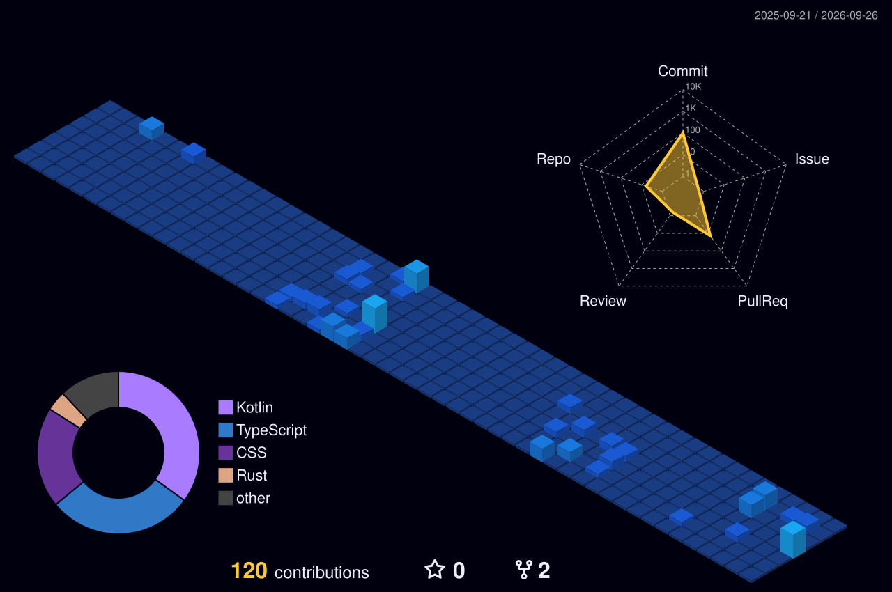

# Muhammad Faiz Aqeel

Software Developer from Indonesia 🇮🇩 focused on building modern web applications, Android interfaces, and system-level tools.

  
  
  

---

## About Me

Hello! I'm **Faiz Aqeel**, a software developer interested in application development, automation, and building practical digital tools.

- **Web**: Developing scalable applications and APIs with **TypeScript**, **React**, and **Next.js**
- **Mobile**: Building modern Android applications with **Kotlin** and **Jetpack Compose**
- **Systems**: Exploring systems programming and Windows automation with **Rust**
- **Deployment**: Managing continuous delivery and deployment workflows via **Vercel** and **GitHub Actions**

---

## Technologies I Use

  

---

## GitHub Statistics

  
  

---

## 3D Contribution Graph

  

---

## Contact

Feel free to reach out for collaboration or questions:

  
  
  

