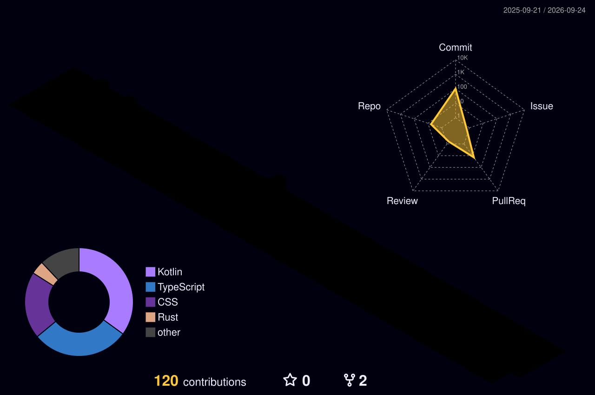

  

  

   

  
  
  

---

## About Me

Hello! I'm **Faiz Aqeel**, a software developer from Indonesia who is interested in application development, automation, and building useful digital products.

I enjoy turning ideas into real-world applications that are practical, user-friendly, and continuously improving through learning and experimentation.

My current areas of interest include:

- Building web applications and APIs with **TypeScript**
- Developing Android applications with **Kotlin** and **Jetpack Compose**
- Exploring system tools and Windows customization with **Rust**
- Designing modern, responsive, and user-friendly interfaces
- Deploying applications using platforms such as **Vercel**

> I believe great projects are built through curiosity, consistency, and the willingness to keep improving.

## Technologies I Use

  

## GitHub Statistics

  

  

 

  

## Contribution Graph

  

## Currently Learning

- Building scalable web applications
- Creating Android interfaces with Jetpack Compose
- Learning system programming with Rust
- Improving software architecture and clean code practices
- Developing APIs and deployment workflows

##Contact Me

  
  
  

 

  <i>"Build with purpose, learn with curiosity, and keep moving forward."</i>

